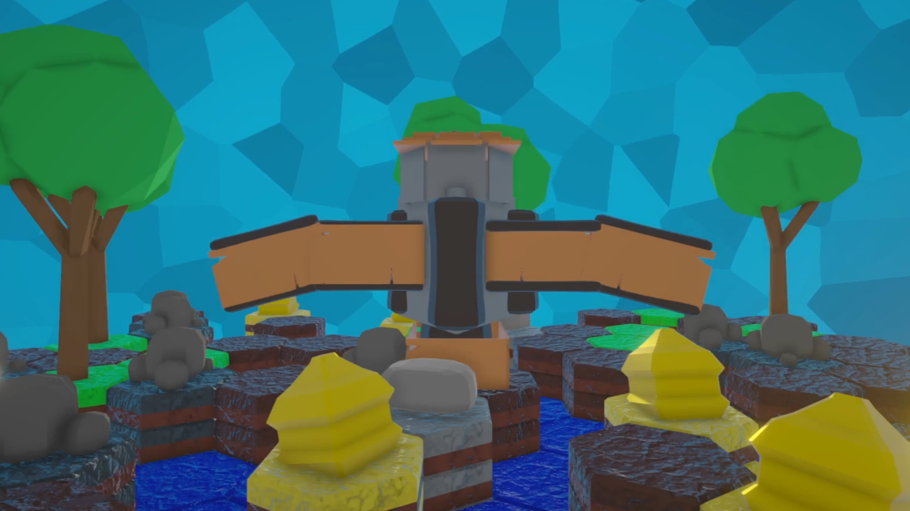

# Title
### Simple description of the post bla bla bla 

## topic 1
bla bla bla 

## topic 2
bla bla bla 
```c++
#include <iostream>
int main()
{
	std::cout<<"Hello World" <<std::endl;
	return 0;
}
```

## topic 3


